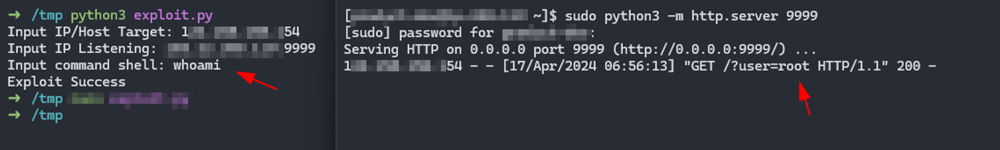

### CVE-2024-3400: OS Command Injection Vulnerability

**Description:**
CVE-2024-3400 is a security vulnerability affecting applications or services that accept user input and execute operating system commands based on that input without adequate validation. This vulnerability allows attackers to inject malicious or damaging OS commands through received input, potentially resulting in system exploitation, data manipulation, or even full control over the vulnerable system.

For more information and updates, please refer to the [CVE-2024-3400](https://cve.mitre.org/cgi-bin/cvename.cgi?name=CVE-2024-3400).

*Note
Please wait for the response results. The response takes quite a long time

